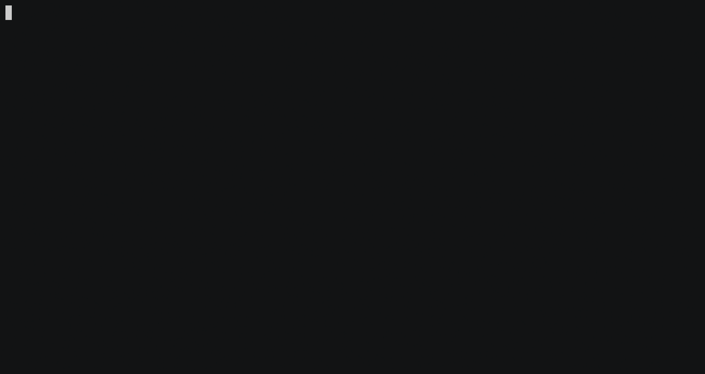
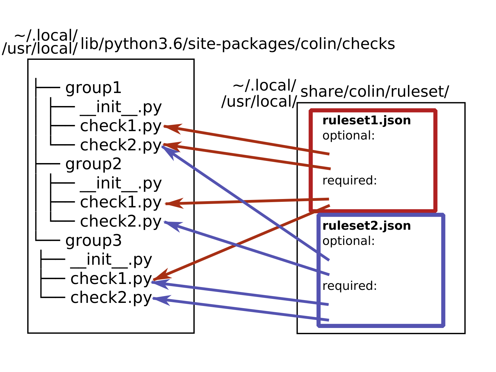

# Colin

Tool to check generic rules/best-practices for containers/images/dockerfiles.

Initial plan is to validate containers/images/dockerfiles against different ecosystems:
 - Red Hat Container Catalogue
 - Fedora Infra (and container guidelines)
 - CentOS
 - Atomic Container Best Practices

*Colin* will also provide generic checks for maintainers or users of containerized content.




## Usage


### Installing via `pip`


```bash
$ pip3 install --user colin
```

> If you are on Fedora distribution, please install python3-pyxattr so you don't have to compile yourself when getting it from PyPI.

This is how you can use colin afterwards:

```
$ colin -h
Usage: colin [OPTIONS] COMMAND [ARGS]...

  COLIN -- Container Linter

Options:
  -V, --version  Show the version and exit.
  -h, --help     Show this message and exit.

Commands:
  check          Check the image/container (default).
  list-checks    Print the checks.
  list-rulesets  List available rulesets.
```
```
$ colin check -h
Usage: colin check [OPTIONS] TARGET

  Check the image/container (default).

Options:
  -r, --ruleset TEXT           Select a predefined ruleset (e.g. fedora).
  -f, --ruleset-file FILENAME  Path to a file to use for validation (by
                               default they are placed in /usr/share/colin).
  --debug                      Enable debugging mode (debugging logs, full
                               tracebacks).
  --json FILENAME              File to save the output as json to.
  -s, --stat                   Print statistics instead of full results.
  -v, --verbose                Verbose mode.
  -h, --help                   Show this message and exit.
```

Let's give it a shot:
```
$ colin -f ./ruleset/redhat.json rhel7
LABELS:
nok:failed:maintainer_label_required
   -> Label 'maintainer' has to be specified.
   -> The name and email of the maintainer (usually the submitter).
   -> https://fedoraproject.org/wiki/Container:Guidelines#LABELS
ok :passed:name_label_required
ok :passed:com_redhat_component_label_required
ok :passed:summary_label_required
ok :passed:version_label_required
nok:failed:usage_label_required
   -> Label 'usage' has to be specified.
   -> A human readable example of container execution.
   -> https://fedoraproject.org/wiki/Container:Guidelines#LABELS
ok :passed:io_k8s_display-name_label_required
ok :passed:io_openshift_tags_label_required
ok :passed:architecture_label
```

We can also check containers:
```
$ docker run --name some-fedora -d fedora sleep 300
$ colin -f ./ruleset/default.json some-fedora
LABELS:
nok:failed:maintainer_label_required
   -> Label 'maintainer' has to be specified.
   -> The name and email of the maintainer (usually the submitter).
   -> https://fedoraproject.org/wiki/Container:Guidelines#LABELS

$ docker run --name my-fedora -l maintainer=myname -d fedora sleep 300
# Adding maintainer name fixes the check:
$ colin -f ./ruleset/default.json  my-fedora
LABELS:
ok :passed:maintainer_label_required
```


### Directly from git

Once you clone colin locally, you can invoke it directly from git:

```
$ git clone https://github.com/user-cont/colin.git
$ cd colin
$ python3 -m colin.cli.colin -h
Usage: colin [OPTIONS] COMMAND [ARGS]...

  COLIN -- Container Linter

Options:
  -V, --version  Show the version and exit.
  -h, --help     Show this message and exit.

Commands:
  check          Check the image/container (default).
  list-checks    Print the checks.
  list-rulesets  List available rulesets.
```

We can now run the analysis:

```
$ python3 -m colin.cli.colin -f ./ruleset/fedora.json fedora:27
LABELS:
nok:failed:maintainer_label_required
   -> Label 'maintainer' has to be specified.
   -> The name and email of the maintainer (usually the submitter).
   -> https://fedoraproject.org/wiki/Container:Guidelines#LABELS
nok:failed:name_label_required
   -> Label 'name' has to be specified.
   -> Name of the Image or Container.
   -> https://fedoraproject.org/wiki/Container:Guidelines#LABELS
nok:failed:com_redhat_component_label_required
   -> Label 'com.redhat.component' has to be specified.
   -> The Bugzilla component name where bugs against this container should be reported by users.
   -> https://fedoraproject.org/wiki/Container:Guidelines#LABELS
nok:failed:summary_label_required
   -> Label 'summary' has to be specified.
   -> A short description of the image.
   -> https://fedoraproject.org/wiki/Container:Guidelines#LABELS
nok:failed:version_label_required
   -> Label 'version' has to be specified.
   -> Version of the image.
   -> https://fedoraproject.org/wiki/Container:Guidelines#LABELS
nok:failed:usage_label_required
   -> Label 'usage' has to be specified.
   -> A human readable example of container execution.
   -> https://fedoraproject.org/wiki/Container:Guidelines#LABELS
...
```


## Technical details

*Colin* will be available as a Python API, and will provide command line interface so you can easily use it locally.

Each ecosystem will define a set of checks to validate the artifacts. Checks will have different severity level so that we can classify checks as required or optional.



## TODO

- [ ] support Fedora infrastructure ([see issue about GSoC project for more information](https://github.com/user-cont/colin/issues/3))
